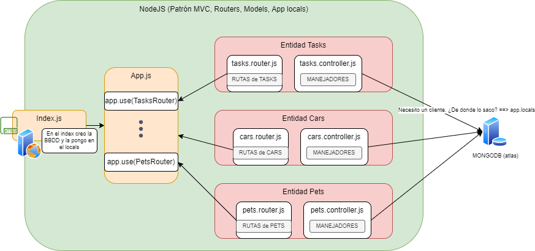

# MVC

El patrón MVC nos indica cómo debemos estructurar los archivos para poder escalar mucho más una aplicación.

La estructura de archivos es la que se muestra en la imagen:



## ¿Pasos para crear una entidad?

1. Crear la carpeta _entidad_
2. Crear dentro de la carpeta un archivo _entidad_.router.js. Este archivo contendrá la definición de las rutas de esa entidad (GET, POST, PUT, ...)
    - Para ello debemos crear un [Router de express](https://expressjs.com/es/4x/api.html#router). Todo lo que debemos saber sobre rutas se encuentra en [este tutorial](https://expressjs.com/es/guide/routing.html)
    - Las rutas tienen un manejador que se deberá importar del archivo de controladores (punto 3)
    - El router lo exportaremos por defecto (`export default`)
3. Crear un archivo en la carpeta llamado _entidad_.controller.js. Este archivo contendrá los manejadores Finales de la ruta, es decir, los que asociamos al Router.
    - El controller es un archivo lleno de funciones exportadas, una para cada ruta.
    - Esas funciones son las que hacen el CRUD.
    - Para obtener el cliente de BBDD la sacamos del locals de express.
    ¿Como lo obtengo?
    Para ello dentro del `req` tenemos una propiedad llamada `app`, que es el objeto de la aplicación de express. Dentro de este app estará la propiedad `locals` y ahi obtendremos el cliente: ej: `req.app.locals.ddbbClient` (Suponiendo que hayamos guardad el cliente en una propiedad `ddbbClient`).

4. En el app.js, debemos importar el router y utilizar la función `app.use('/entidad', Router)`

## ¿Ese locals de donde lo saco?

Locals es una variable que nos da express dentro del objeto `app`. Sirve para almacenar datos y variables comunes que puedan utilizar TODAS las rutas.

En este locals es donde vamos a guardar el cliente de BBDD para hacer las conexiones con Mongo (Queries y todos las operaciones del CRUD)

Le puedo dar valor al locals añadiendo al app.

```js

app.locals.myProp = 33; // ahora todas las rutas pueden acceder a ese valor 33
// ¿Como acceden las rutas?
req.app.locals.myProp; // esto tendría el valor 33

```

## ¿Donde creo el cliente de MongoBD?

Como este cliente es muy costoso de crear lo vamos una vez cuando se levante el servidor, por tanto tenemos que crearlo en el `index.js`.

```js
import { MongoClient } from 'mongodb';
import app from 'app.js';


const URI = 'URL_CONEXION_CON_MONGO'; // esto se recomienda tener en un archivo .env y gestionarlo con la librería `dotenv`

const client = new MongoClient(URI); // creamos el cliente

async function start(){// esta función se encarga de levantar el cliente y el servidor
    try{
        await client.connect(); // esta es la que abre el canuto, la tubería o como queramos llamarlo
        app.locals.ddbbClient = client; // guardo el cliente conectado en el app locals
        // levantamos el servidor cuando tengamos el cliente en el locals
        app.listen(3001, () => console.log('Servidor escuchando en el 3001'));
    }catch(err){
        console.error('Error en el servidor: ', err);
        process.exit(1); // salimos del proceso
    }
}

async function stop(){
    console.log('Parando el servidor y cerrando la BBDD');
    await client.close(); // cierro la BBDD
}

process.on('SIGINT', stop); // eventos del SO cuando hacemos ctrl+c
process.on('SIGTERM', stop);

start(); // lamamos a la función start que inicia todo (BBDD y Server de express)

```
