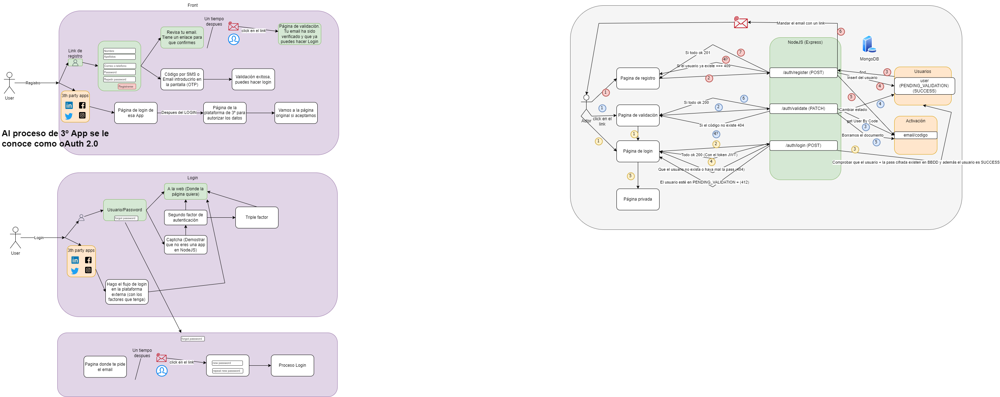

# Introducción y Mecanismos

## ¿Que es la autenticación y la autorización?

La **autenticación** consiste en indicarle a un sistema quien eres y asi el sistema se asegura que eres quien dices que eres.

La **autorización** consiste en que el sistema cuando recibe una petición autenticada, decide si AUTORIZA a ese usuario a realizar la operación que quiere realizar. Si NO está autorizado es un 403 y si NO está autenticado es un 401.

## ¿Como puedo desde un cliente por HTTP indicarle quien soy (Autenticarme)?

Hay muchas formas, pero tenemos 4 principales:

1. **Basic Authentication**: Consiste en cada llamada (petición HTTP) meter usuario y password. ¿Cómo?:
   - url: Antes del host ponemos http(s)://_user:pass_@host/path?query (MEGAMEGAMEGA INSEGURA)
   - header: Llamada `Authorization`. En el valor de la header, debemos indicar el tipo de autenticación seguir de un token. `Basic _base64(user:pass)_`. Por ejemplo para usario alex y pass 123456 --> `Basic YWxleDoxMjM0NTY=`
     - funciones para codificar y decodificar. btoa('alex:123456'), atob('YWxleDoxMjM0NTY=')

2. **Api key Authentication**: Consiste en tener un panel de administración para poder generar tokens que me identifiquen y entonces o utilizando un query param (no recomendado) o utilizando la header de autenticación en cada petición estamos diciendo quien somos. Este método es el utilizado en el weather app y se usa sobre todo par aconsume de API's

3. **oAuth 2.0**: Es la delegación de la autenticación en un tercero (Google, FB, ...)

4. **Token JWT**: Consiste en que haces una autenticación con tu usuario+pass+otp+biometrics, etc. (Login). El login genera un token de sesión con un formato especial JWT (Json Web Token). A partir del login TODAS las peticiones el backend tiene que tener la cabecera de `Authorization` con valor `Bearer <token_JWT>`. [Jwt página](https://jwt.io/)

## Flujo de login y registro

